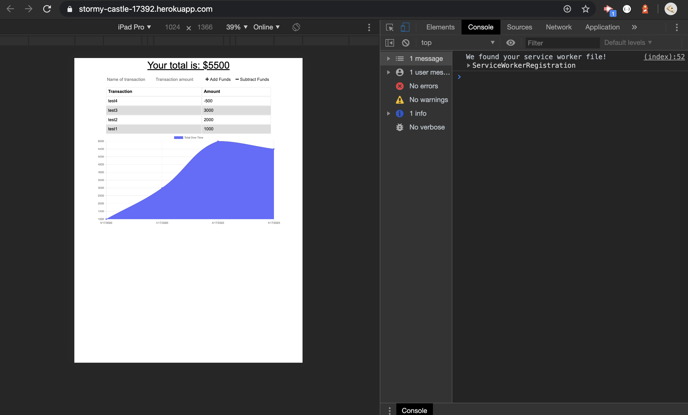
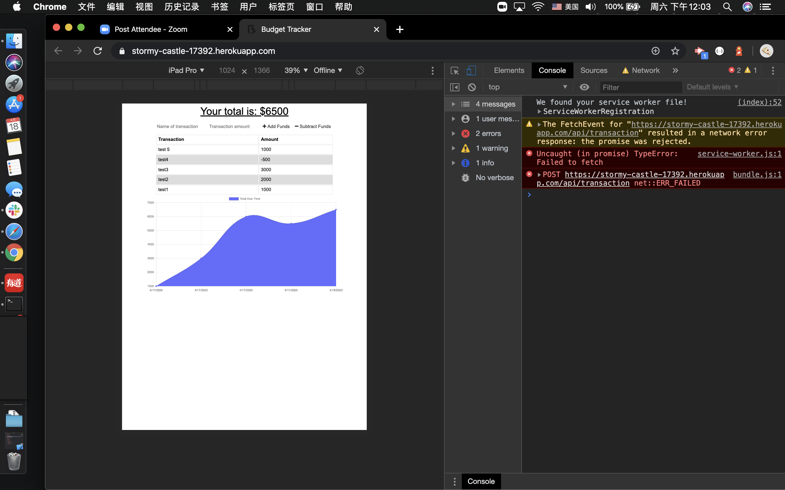
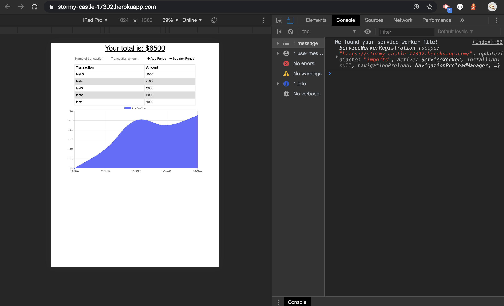

# Budget-Tracker
[Budget Tracker Deploy Application!](https://stormy-castle-17392.herokuapp.com/) - https://stormy-castle-17392.herokuapp.com/
Budget-tracker is a  app where the user will be able to add expenses and deposits to their budget with or without a connection. When entering transactions offline, they should populate the total when brought back online.

* Enter deposits/expenses online will store data to mongo database.

* Enter deposits/expenses offline will store data to indexDB

* When user back online the data will be sent from indexDB to mongo database.

